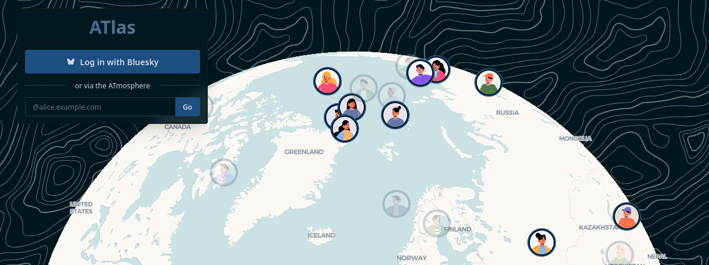

# ATlas

[Atproto](https://atproto.com/)-backed clone of [meetinghouse.cc](meetinghouse.cc/).




## Build & Run
_If you don't use [mise](https://mise.jdx.dev/), you can just run the commands inside of `mise.toml` individually._

### Dependencies:
```bash
mise deps
```
_You'll also need `sqlite-devel` available locally_

### Run locally:
```bash
mise dev 
```

Seeding the local DB with pins can be done by running `go run generate_mock_pins.go` in the `scripts/` directory.

### Cut a build:
```bash
mise build
```